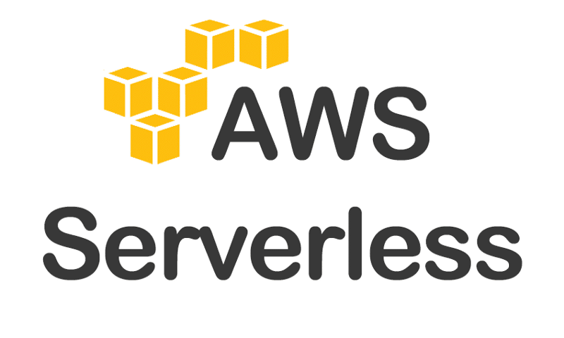
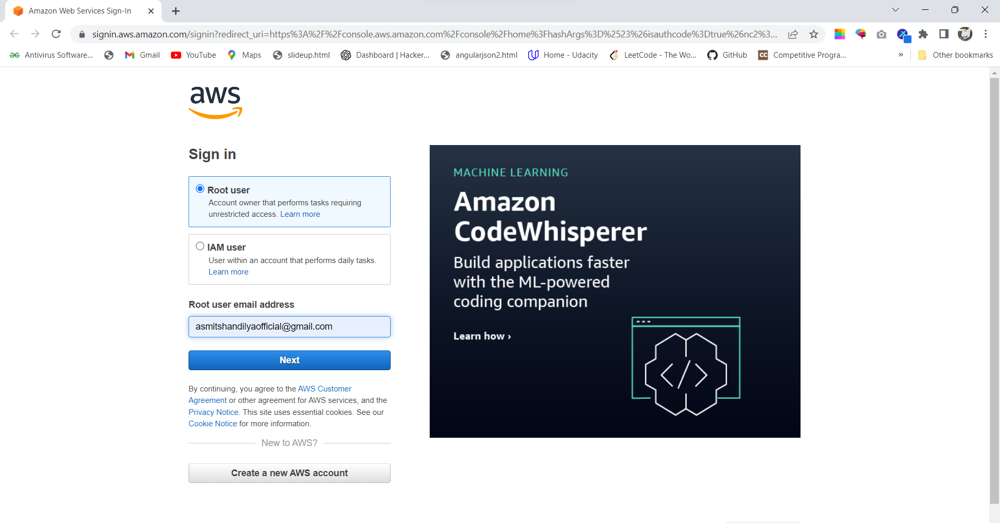
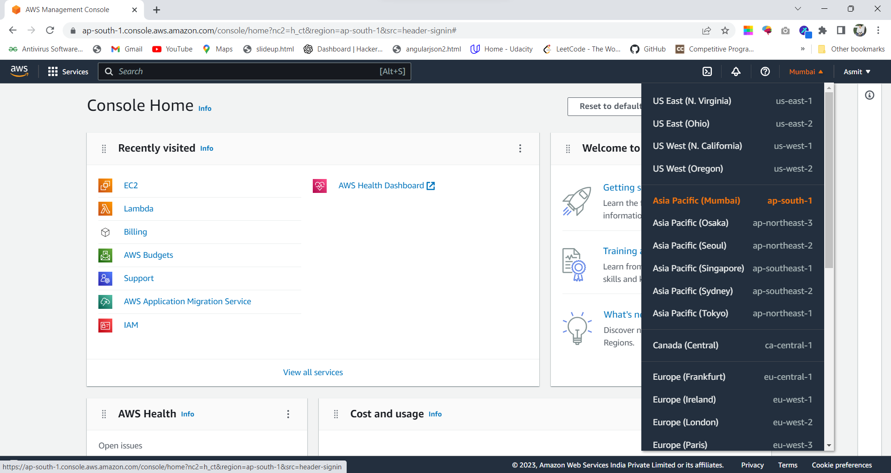
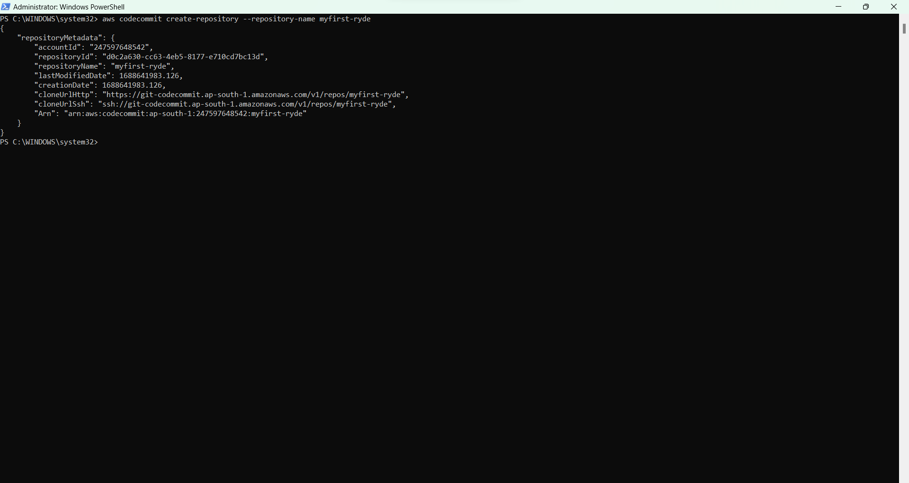
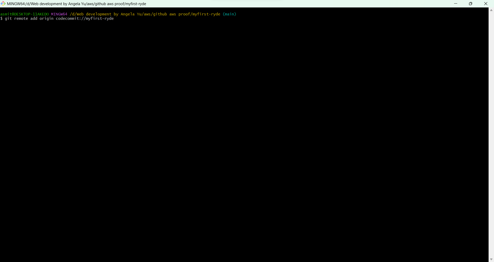
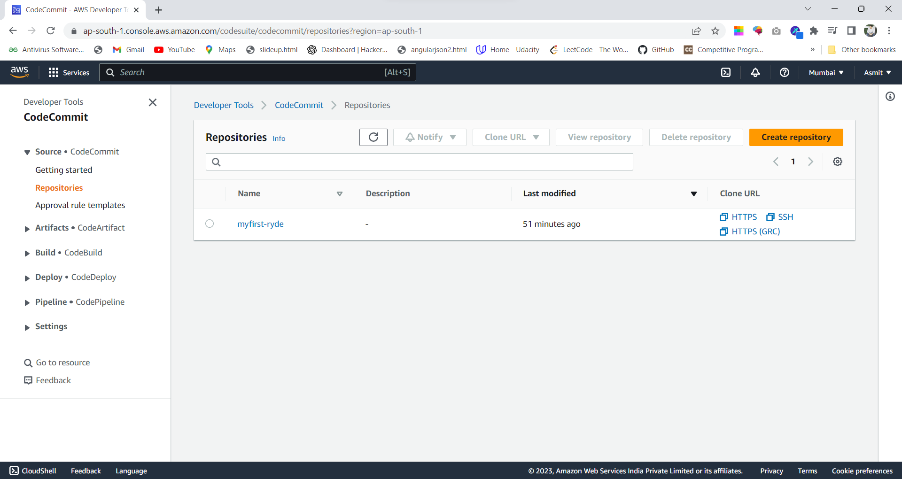

 

  
<h3 align="center">myFirstRyde</h3>

 

    <h3>project_description</h3>
     
    <a href="#table"><strong>Explore the docs »</strong></a>
     
     
    <h3></h3> 
    <a href="https://main.dreulf2ss4g7l.amplifyapp.com/">View Demo</a>

  

    
Table of Contents

    <ol>
      <li>
        <a href="#about-the-project">About The Project</a>
        <ul>
          <li><a href="#built-with">Built With</a></li>
        </ul>
      </li>
      <li>
        <a href="#getting-started">Getting Started</a>
        <ul>
          <li><a href="#prerequisites">Prerequisites</a></li>
          <li><a href="#Steps">Steps</a></li>
        </ul>
      </li>
    </ol>
  

  
  ## About The Project

![Product Name Screen Shot][project]

This is a serverless web application based on aws services like lambda, dynamodb, cognito, api gateway,amplify and cloudwatch.
First I will describe each aws services in short then i will give a step by step guide to make the project with images. 

(<a href="#readme-top">back to top</a>)

### Built With

- [![Aws Lambda][Lambda]][Lambda-url]
- [![Aws Amplify][Amplify]][Amplify-url]
- [![Aws Cognito][Cognito]][Cognito-url]
- [![Aws Api-Gateway][api-gateway]][api-gateway-url]
- [![Aws CloudWatch][Cloud-watch]][cloud-watch-url]
- [![Aws DynamoDB][DynamoDB]][DynamoDb]
- [![Aws SNS][SNS]][SNS-url]
- [![Aws SQS][SQS]][SQS-url]

## Getting Started

You need and Aws account as a root user. To proceed with the project. For verification of my work kindly click on the "view demo" button.
![architecture][architecture]

### Prerequisites

1. Install Aws cli with the following command.
2. create a codecommit repository and initialize on the local computer.

## Steps

<ol>
  <li> Sign in to the account</li>
  <li> Host the static website
    <ol>
      <li>Select a Region </li>
      <li>Create a Git Repository</li>
      <li>Clone the code from my repository</li>
      <li>Clone the empty repository from codecommit</li>
      <li>Populate the repository</li>
      <li>Enable Web Hosting with Aws Amplify Console</li>
      <li>Populate the repository</li>
    </ol>
  </li>
  <li> Configure User Management
    <ol>
      <li>Create Amazon Cognito User Pool and integrate the app to the user pool</li>
      <li>Update the website Config</li>
      <li>Validate the Implementation</li>
    </ol>
  </li>
  <li>Serverless Service Backend
  <ol>
    <li>Create Amazon DynamoDB Table</li>
    <li>Create IAM Role for the Lambda Function</li>
    <li>Create a lambda function for handling request</li>
    <li>Validate the implementation</li>
  </ol>
  </li>
  <li>Deploy Restful Api</li>
  <ol>
    <li>Create a new Rest Api</li>
    <li>Create a new resource and method</li>
    <li>Deploy an Api</li>
    <li>Update the Website Config</li>
  </ol>
</ol>

[project]: images/project_image.png

[Lambda]:
[Lambda-url]:
[architecture]:images/architecture.png
